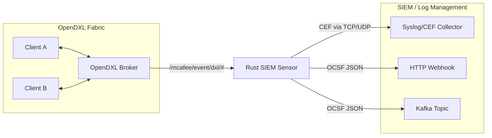

# OpenDXL SIEM Sensor (Rust)

Ein leichtgewichtiger Sensor zur Überwachung einer OpenDXL-Fabric. Der Sensor verbindet sich als passiver Teilnehmer (Subscriber) mit dem OpenDXL-Broker-Netzwerk, überwacht sicherheitsrelevante Ereignisse und exportiert diese in standardisierten Formaten (CEF/Syslog, OCSF) an ein Security Information and Event Management (SIEM) System.

## Architektur



Der Sensor arbeitet passiv und erfordert keine Anpassungen an bestehenden Clients. Er konsumiert die internen Registry-Events des Brokers und analysiert sie auf Anomalien.

## Voraussetzungen

- **Rust-Toolchain:** Zum Kompilieren des Sensors (`cargo build --release`).
- **OpenDXL Broker:** Getestet gegen OSS-Broker und Trellix Broker (v6.1.3+).
  - *Wichtig:* Der Sensor nutzt `rustls` für die TLS-Verbindung. `rustls` unterstützt kein RSA Key Exchange (RSA-Kex). Der Broker muss zwingend PFS-Suiten (Perfect Forward Secrecy, z.B. ECDHE oder TLS 1.3) anbieten. Alte Broker, die nur `TLS_RSA_*` unterstützen, werden abgewiesen.
- **Zertifikate:** Ein eigenes Client-Zertifikat für den Sensor, provisioniert über das Python-Tooling:
  ```bash
  python -m dxlclient provisionconfig <zielordner> <broker-ip> rust-sensor -u admin -p password
  ```
  *(Hinweis: Für saubere v3-Zertifikate wird der Console-Fork mit Fix f4a17e2 empfohlen).*

## Konfiguration

Der Sensor liest die Standard `dxlclient.config` (INI-Format). Diese wird um einen Sensor-spezifischen Abschnitt erweitert:

```ini
[Certs]
BrokerCertChain=ca-bundle.crt
CertFile=client.crt
PrivateKey=client.key

[Brokers]
mybroker=mybroker;8883;broker.local;192.168.1.10

[General]
ClientId={your-uuid-here}
VerifyHostname=false
TlsMinVersion=1.2

[Sensor]
# Erlaubte Zertifikats-Thumbprints (SHA-1 Hex, klein geschrieben)
AllowedThumbprints=5a752ed6a24f6d2dd77634b0c68dd729b48d4613, a1b2c3d4...
# Topics, die überwacht werden sollen (Publisher-Alarm)
SensitiveTopics=/mcafee/service/tie/file/reputation/set
# Kulanzzeit in Minuten, bevor ein abgelaufener Dienst gemeldet wird (Default: 5)
GracePeriodMins=5

[Output]
SyslogHost=127.0.0.1
SyslogPort=514
SyslogProtocol=udp
HttpWebhookUrl=http://siem.local:8080/ingest
# Optional, erfordert Feature-Flag `rdkafka`
# KafkaBrokers=kafka.local:9092
# KafkaTopic=dxl-events
```

## Detections und CEF-Beispiele

Der Sensor generiert eigene Alarme (Detection Findings), wenn er verdächtige Verhaltensweisen auf der Fabric erkennt. 

**1. Legacy Cipher Suite (Schwache Verschlüsselung)**
Ausgelöst, wenn ein Client mit einer alten, nicht-PFS Cipher Suite (z.B. `TLS_RSA_WITH_AES_128_CBC_SHA256`) verbindet.
> `CEF:0|OpenDXL|RustSensor|1.0|2004|Legacy Cipher Suite|4|msg=Client connected with weak legacy cipher: TLS_RSA_WITH_AES_128_CBC_SHA256 suser=5a752ed6a24f6d2dd77634b0c68dd729b48d4613 deviceCustomNumber1=200401 deviceCustomNumber1Label=type_uid`

**2. Unknown Certificate Thumbprint (Unbekannte Identität)**
Ausgelöst, wenn ein Dienst oder Client sich registriert/verbindet, dessen Thumbprint nicht in der `AllowedThumbprints` Liste steht.
> `CEF:0|OpenDXL|RustSensor|1.0|2004|Unknown Certificate Thumbprint|4|msg=Client connected with unknown thumbprint: 9999999999999999999999999999999999999999 suser=9999999999999999999999999999999999999999 deviceCustomNumber1=200401 deviceCustomNumber1Label=type_uid`

**3. Sensitive Topic Published (Unautorisierter Zugriff)**
Ausgelöst, wenn ein Client Nachrichten auf einem als sensibel konfigurierten Topic publiziert.
> `CEF:0|OpenDXL|RustSensor|1.0|2004|Sensitive Topic Published|4|msg=Client 5a752ed6a24f6d2dd77634b0c68dd729b48d4613 published to sensitive topic /mcafee/service/tie/file/reputation/set suser=5a752ed6a24f6d2dd77634b0c68dd729b48d4613 deviceCustomNumber1=200401 deviceCustomNumber1Label=type_uid`

**4. Service TTL Expired (Dienst-Ausfall)**
Ausgelöst, wenn die TTL (Time To Live) eines registrierten Dienstes abläuft und er sich nicht innerhalb der `GracePeriodMins` re-registriert oder sauber abmeldet.
> `CEF:0|OpenDXL|RustSensor|1.0|2004|Service TTL Expired|4|msg=Service {guid} (/mcafee/service/tie/file/reputation) TTL expired without unregister deviceCustomNumber1=200401 deviceCustomNumber1Label=type_uid`

**5. Fabric Change Detected**
Ausgelöst bei Topologie-Änderungen im Broker-Netzwerk (Bridges up/down).

Zusätzlich zu Detections werden reguläre Audit-Events protokolliert, z.B. Network Connect:
> `CEF:0|OpenDXL|RustSensor|1.0|4001|Connect|1|app=mqtt deviceCustomNumber1=400101 deviceCustomNumber1Label=type_uid deviceCustomString1=5a752ed6a24f6d2dd77634b0c68dd729b48d4613 deviceCustomString1Label=client_guid deviceCustomString2=TLSv1.3 deviceCustomString2Label=tls_version deviceCustomString3=TLS_AES_256_GCM_SHA384 deviceCustomString3Label=cipher deviceCustomString4=5a752ed6a24f6d2dd77634b0c68dd729b48d4613 deviceCustomString4Label=cert_thumbprint src=172.17.0.1`

## Betrieb

- **Starten:** `DXL_CONFIG=/pfad/zur/dxlclient.config ./rust-siem-sensor`
- **Exit-Codes:** 
  - `0`: Normales Beenden.
  - `2`: Fehler beim Laden der Konfiguration (z.B. Pfad nicht gefunden oder INI ungültig).
- **Logging:** Der Sensor nutzt `env_logger`. Loglevel steuerbar über `RUST_LOG` (z.B. `RUST_LOG=info`).
- **Connect-Events:** Standardmäßig veröffentlichen Broker (Trellix und OSS) keine Events beim reinen Verbindungsaufbau von Clients. Der Sensor ist fehlertolerant konstruiert und arbeitet auch ohne diese Events zuverlässig, da Dienst-Registrierungen (`svcregistry`) als Hauptquelle dienen. Um Connect-Events für Client-Sichtbarkeit und Legacy-Cipher-Detections zu nutzen, muss im modifizierten Broker-Fork `DXL_SEND_CONNECT_EVENTS=true` gesetzt sein.

## Tests

- Unit-Tests: `cargo test`
- Um Integrations-Tests gegen lokale Broker-Instanzen auszuführen, müssen Umgebungsvariablen gesetzt werden, die auf entsprechende Config-Verzeichnisse zeigen:
  - `DXL_SENSOR_TEST_CONFIG`: Konfiguration für einen Broker mit ECDHE/TLS 1.2 (z.B. `dxl-modern`).
  - `DXL_SENSOR_TEST_CONFIG_TLS13`: Konfiguration für einen Broker mit TLS 1.3 (z.B. `dxlbroker:almalinux`).
  - Ohne diese Variablen werden die Verbindungs-Tests übersprungen.
- Für die Validierung der MessagePack-Kodierung nutzt der Sensor eine Java-Referenzdatei (`tests/fixtures/golden.txt`). Sie kann über `DXL_GOLDEN_TXT` überschrieben werden.

## OCSF Mapping

Details zur Abbildung der OpenDXL-Ereignisse auf das Open Cybersecurity Schema Framework (OCSF) finden sich in der [OCSF-MAPPING.md](docs/OCSF-MAPPING.md).
