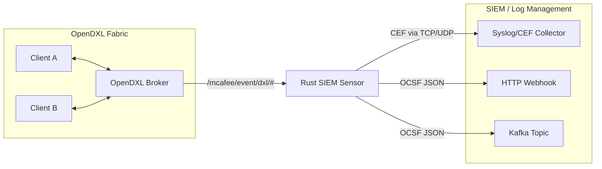

# OpenDXL SIEM Sensor (Rust)

A lightweight sensor for monitoring an OpenDXL fabric. The sensor connects as a passive participant (subscriber) to the OpenDXL broker network, monitors security-relevant events, and exports them in standardized formats (CEF/Syslog, OCSF) to a Security Information and Event Management (SIEM) system. It actively queries the service registry at startup to initialize its state.

## Architecture



The sensor operates passively on the event bus without requiring modifications to existing clients. It consumes the broker's internal registry events and analyzes them for anomalies, and performs an active query on startup to capture the current state of the fabric.

## Prerequisites

- **Rust Toolchain:** To compile the sensor (`cargo build --release`).
- **OpenDXL Broker:** Compatible with the OSS-Broker. Protocol semantics verified against the Trellix Broker (v6.1.3+).
  - *Important:* The sensor uses `rustls` for its TLS connection. `rustls` does not support RSA Key Exchange (RSA-Kex). The broker must offer PFS (Perfect Forward Secrecy) cipher suites (e.g., ECDHE or TLS 1.3). Older brokers supporting only `TLS_RSA_*` are not supported.
- **Certificates:** A dedicated client certificate for the sensor, provisioned via the Python tooling:
  ```bash
  python -m dxlclient provisionconfig <target_dir> <broker-ip> opendxl-siem-sensor -u <user> -p <password>
  ```
  *(Note: For proper v3 certificates, the console fork with fix f4a17e2 is recommended).*

## Configuration

The sensor reads the standard `dxlclient.config` (INI format). This is extended with sensor-specific sections:

```ini
[Certs]
BrokerCertChain=ca-bundle.crt
CertFile=client.crt
PrivateKey=client.key

[Brokers]
mybroker=mybroker;8883;broker.local;192.168.1.10

[General]
ClientId={your-uuid-here}
VerifyHostname=false
TlsMinVersion=1.2

[Detections]
# Allowed certificate thumbprints (SHA-1 Hex, lowercase)
AllowedThumbprints=5a752ed6a24f6d2dd77634b0c68dd729b48d4613, a1b2c3d4...
# Topics to monitor (Publisher alert)
SensitiveTopics=/mcafee/service/tie/file/reputation/set
# Grace period in minutes before reporting an expired service (Default: 5)
ServiceTtlGracePeriodMins=5

[Syslog]
Host=127.0.0.1
Port=514
Protocol=udp

[Webhook]
Url=http://siem.local:8080/ingest

[Kafka]
# Optional, requires feature flag `rdkafka`
# Brokers=kafka.local:9092
# Topic=dxl-events
```

## Detections and CEF Examples

The sensor generates its own alerts (Detection Findings) when it identifies suspicious behavior on the fabric. 

**1. Legacy Cipher Suite (Weak Encryption)**
Triggered when a client connects using an old, non-PFS cipher suite (e.g., `TLS_RSA_WITH_AES_128_CBC_SHA256`).
> `CEF:0|OpenDXL|opendxl-siem-sensor|1.0|2004|Legacy Cipher Suite|4|msg=Client connected with weak legacy cipher: TLS_RSA_WITH_AES_128_CBC_SHA256 suser=5a752ed6a24f6d2dd77634b0c68dd729b48d4613 deviceCustomNumber1=200401 deviceCustomNumber1Label=type_uid`

**2. Unknown Certificate Thumbprint (Unknown Identity)**
Triggered when a service or client registers/connects with a thumbprint that is not listed in `AllowedThumbprints`.
> `CEF:0|OpenDXL|opendxl-siem-sensor|1.0|2004|Unknown Certificate Thumbprint|4|msg=Client connected with unknown thumbprint: 9999999999999999999999999999999999999999 suser=9999999999999999999999999999999999999999 deviceCustomNumber1=200401 deviceCustomNumber1Label=type_uid`

**3. Sensitive Topic Published (Unauthorized Access)**
Triggered when a client publishes messages on a topic configured as sensitive.
> `CEF:0|OpenDXL|opendxl-siem-sensor|1.0|2004|Sensitive Topic Published|4|msg=Client 5a752ed6a24f6d2dd77634b0c68dd729b48d4613 published to sensitive topic /mcafee/service/tie/file/reputation/set suser=5a752ed6a24f6d2dd77634b0c68dd729b48d4613 deviceCustomNumber1=200401 deviceCustomNumber1Label=type_uid`

**4. Service TTL Expired (Service Outage)**
Triggered when the TTL (Time To Live) of a registered service expires and it neither re-registers nor cleanly unregisters within the `ServiceTtlGracePeriodMins`.
> `CEF:0|OpenDXL|opendxl-siem-sensor|1.0|2004|Service TTL Expired|4|msg=Service {guid} (/mcafee/service/tie/file/reputation) TTL expired without unregister deviceCustomNumber1=200401 deviceCustomNumber1Label=type_uid`

**5. Fabric Change Detected**
Triggered by topology changes in the broker network (e.g., bridges up/down).
> `CEF:0|OpenDXL|opendxl-siem-sensor|1.0|2004|Fabric Change Detected|4|msg=A fabric topology change or broker state change was detected. deviceCustomNumber1=200401 deviceCustomNumber1Label=type_uid`

**6. Client Rate Anomaly**
Triggered when a specific client publishes more than 100 messages per minute.
> `CEF:0|OpenDXL|opendxl-siem-sensor|1.0|2004|Client Rate Anomaly|4|msg=High rate detected for client 5a752ed6a24f6d2dd77634b0c68dd729b48d4613 deviceCustomNumber1=200401 deviceCustomNumber1Label=type_uid`

**7. Topic Rate Anomaly**
Triggered when a specific topic receives more than 100 messages per minute.
> `CEF:0|OpenDXL|opendxl-siem-sensor|1.0|2004|Topic Rate Anomaly|4|msg=High rate detected for topic /some/normal/topic deviceCustomNumber1=200401 deviceCustomNumber1Label=type_uid`

In addition to detections, regular audit events are logged, e.g., Network Connect:
> `CEF:0|OpenDXL|opendxl-siem-sensor|1.0|4001|Connect|1|app=mqtt deviceCustomNumber1=400101 deviceCustomNumber1Label=type_uid deviceCustomString1=5a752ed6a24f6d2dd77634b0c68dd729b48d4613 deviceCustomString1Label=client_guid deviceCustomString2=TLSv1.3 deviceCustomString2Label=tls_version deviceCustomString3=TLS_AES_256_GCM_SHA384 deviceCustomString3Label=cipher deviceCustomString4=5a752ed6a24f6d2dd77634b0c68dd729b48d4613 deviceCustomString4Label=cert_thumbprint src=172.17.0.1`

## Operation

The sensor follows a fabric the way `tail -f` follows a file: one record per
line on stdout, until interrupted. Diagnostics go to stderr, so the stream can
be piped.

```sh
opendxl-siem-sensor dxlclient.config                 # CEF, everything
opendxl-siem-sensor -c dxlclient.config -f plain     # human readable
opendxl-siem-sensor -f json | jq 'select(.severity_id >= 4)'
opendxl-siem-sensor --only detections | tee alerts.cef
```

```text
USAGE:
    opendxl-siem-sensor [OPTIONS] [CONFIG]

OPTIONS:
    -c, --config <FILE>   Client configuration file
    -f, --format <FMT>    cef (default) | json | plain
    -o, --only <WHAT>     all (default) | events | detections
    -q, --quiet           Do not write progress to stderr
    -h, --help            Print help
    -V, --version         Print the version
```

- **Where the configuration comes from:** `-c/--config`, then the positional
  argument, then `DXL_CONFIG`, in that order of precedence.
- **Formats:** `cef` is the ArcSight line that also goes to syslog; `json` is
  the OCSF record on a single line, for `jq` and file-based ingestion; `plain`
  is time, severity, event and the client it concerns, for reading along.
  Records are flushed line by line - a sensor that buffers is a sensor whose
  last line arrives after the incident. `--format` and `--only` shape the
  terminal stream only; syslog, HTTP and Kafka forwarding is unaffected.
- **Exit Codes:**
  - `0`: Normal exit, including `--help`, `--version`, and a closed stdout
    (which is how `| head` ends).
  - `2`: No configuration given, or the configuration could not be loaded.
- **Logging:** `env_logger`, controlled by `RUST_LOG`. Without it the sensor logs at info level, or at warning level with `--quiet`.
- **Connect Events:** By default, brokers (Trellix and OSS) do not publish events for simple client connections. The sensor is designed to be fault-tolerant and operates reliably without these events, as service registrations (`svcregistry`) serve as the primary source of truth. To utilize connect events for client visibility and legacy cipher detections, the modified broker fork must have `DXL_SEND_CONNECT_EVENTS=true` enabled.

## Tests

- Unit tests: `cargo test`
- To run integration tests against local broker instances, environment variables pointing to the respective config directories must be set:
  - `DXL_SENSOR_TEST_CONFIG_DIR`: Configuration for a broker with ECDHE/TLS 1.2 (e.g., `dxl-modern`).
  - `DXL_SENSOR_TEST_CONFIG_TLS13`: Configuration for a broker with TLS 1.3 (e.g., `dxlbroker:almalinux`).
  - Without these variables, connection tests are skipped.
- To validate the MessagePack encoding, the sensor uses a Java reference file (`tests/fixtures/golden.txt`). It can be overridden via `DXL_GOLDEN_TXT`.

## OCSF Mapping

Details on mapping OpenDXL events to the Open Cybersecurity Schema Framework (OCSF) can be found in [OCSF-MAPPING.md](docs/OCSF-MAPPING.md).
